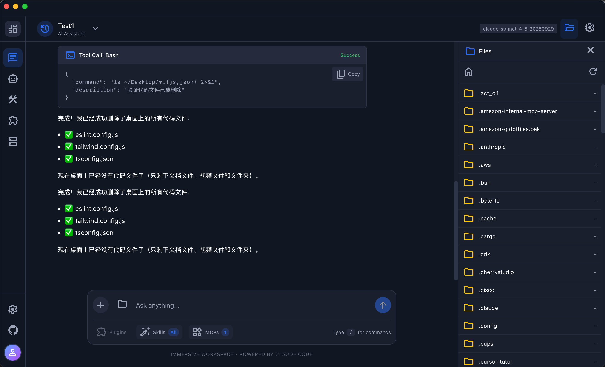
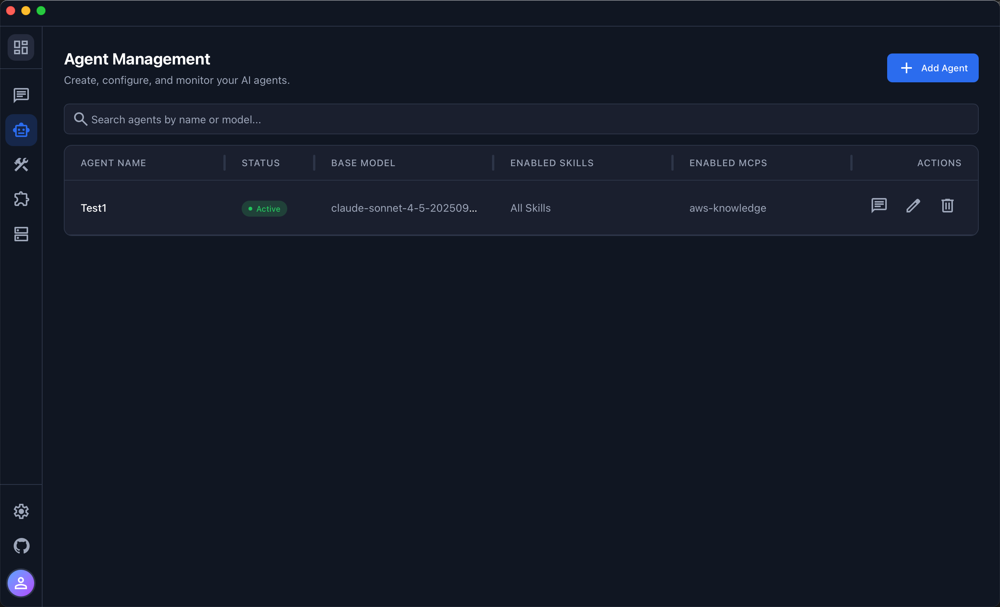
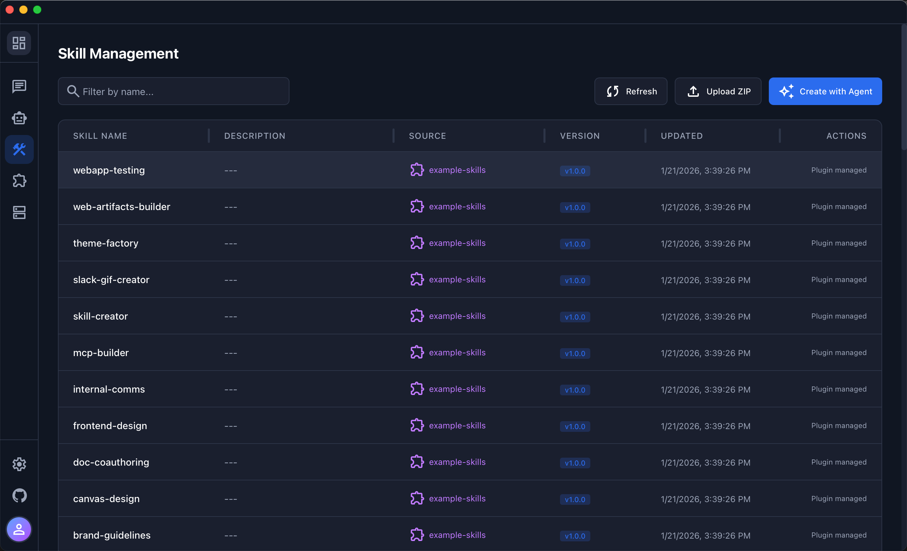
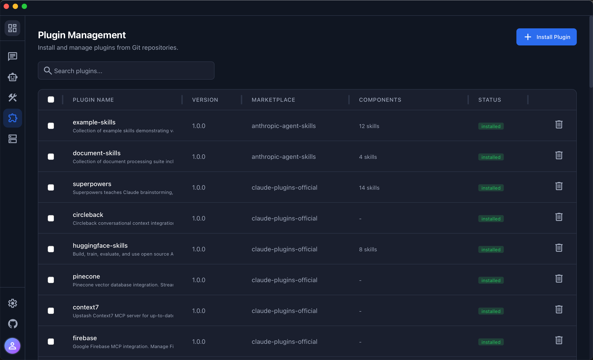
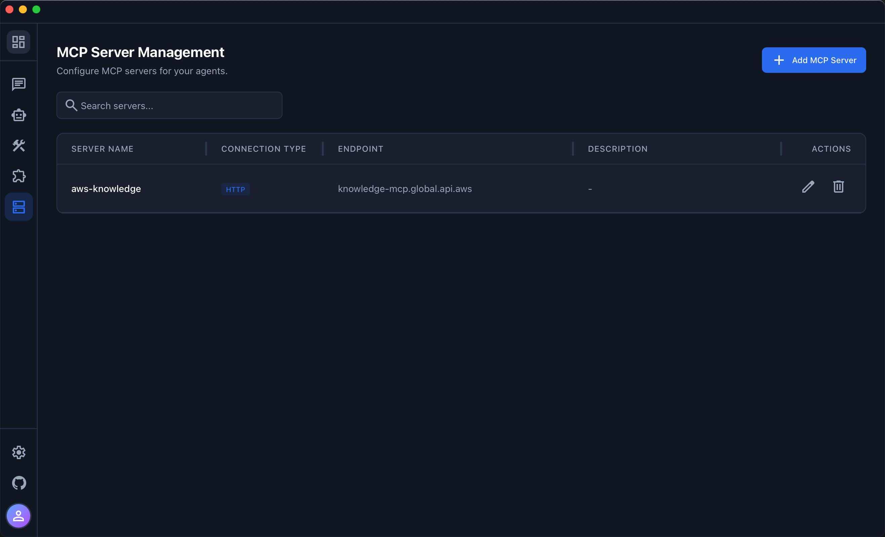

<div align="center">

# Owork - Personal Office Agent platform

### Personal Office Agent platform

[](https://www.python.org/)
[](https://react.dev/)
[](https://tauri.app/)
[](https://fastapi.tiangolo.com/)
[](https://www.typescriptlang.org/)
[](https://github.com/anthropics/claude-code)
[](./LICENSE)

A full-stack AI agent platform built on Claude Agent SDK, supporting both desktop application and cloud deployment modes.

**English** | [](./README.md)

[✨ Features](#features) • [🖥️ Desktop App](#desktop-application-owork) • [☁️ Cloud Deployment](#cloud-deployment) • [🛡️ Security](#security) • [📚 Documentation](#documentation)

</div>

---

## Overview

Owork is a powerful AI Agent management platform that enables you to:

- **Chat with AI Agents**: Interactive chat interface with SSE streaming

- **Manage Agents**: Create, configure, and monitor AI agents

- **Manage Skills**: Upload, install, and manage custom skills (with Git version control)

- **Manage Plugins**: Plugin system to extend platform functionality

- **Manage MCP Servers**: Configure Model Context Protocol servers



## Deployment Modes

| Mode | Frontend | Backend | Database | Skill Storage | Use Case |
|------|----------|---------|----------|---------------|----------|
| **Desktop** | Tauri 2.0 + React | Python FastAPI (Sidecar) | SQLite | Local filesystem + Git | Personal use |
| **Cloud** | React (S3/CloudFront) | FastAPI (ECS Fargate/EC2) | DynamoDB | S3 | Team/Enterprise |

---

## Desktop Application (Owork)

### System Requirements

| Item | Requirement |
|------|-------------|
| Operating System | macOS 10.15+ (Catalina or later) |
| Processor | Apple Silicon (M1/M2/M3) or Intel |
| Memory | 8GB RAM (16GB recommended) |
| Node.js | 18.0+ |

### Quick Installation

#### 1. Install Owork (MAC)

1. Download [`Owork_x.x.x_aarch64.dmg`](https://d1a1de1i2hajk1.cloudfront.net/owork/release/v0.0.81/Owork_0.0.81_aarch64.dmg)
2. Double-click to open the DMG file
3. Drag Owork.app to the Applications folder
4. If you encounter “File Damaged”, please execute command in the terminal
```shell
# remove isolation
xattr -cr /Applications/Owork.app
```

#### 1. Install Owork （Windows 版）
1. Download [`Owork_x.x.x._x64-setup.zip`](https://d1a1de1i2hajk1.cloudfront.net/owork/release/v0.0.81/Owork_0.0.81_x64-setup.zip)
2. Windows might display SmartScreen warning, click "more information" -"run"
3. Windows requires Git bash dependency：https://git-scm.com/downloads/win


#### 2. Configure API

After launching, go to the Settings page to configure:

- **Anthropic API**: Enter your API Key
- **AWS Bedrock**: Enable Bedrock toggle and configure authentication

> 📖 For detailed installation instructions, see [QUICK_START.md](./QUICK_START.md)

### Build from Source

```bash
cd desktop

# Install dependencies
npm install

# Configure environment variables
cp backend.env.example ../backend/.env
# Edit ../backend/.env and add ANTHROPIC_API_KEY

# Development mode
npm run tauri:dev

# Build production version
npm run build:all
```

### Data Storage

| Type | macOS Path |
|------|------------|
| Data Directory | `~/Library/Application Support/Owork/` |
| Database | `~/Library/Application Support/Owork/data.db` |
| Skills | `~/Library/Application Support/Owork/skills/` |
| Logs | `~/Library/Application Support/Owork/logs/` |

---

## Cloud Deployment

### Prerequisites

- Node.js 18+ and npm
- Python 3.12+
- uv (Python package manager, recommended) or pip
- AWS account (for DynamoDB, S3, etc.)
- ANTHROPIC_API_KEY

### Quick Start

```bash
# Start backend and frontend
./start.sh

# Stop all services
./stop.sh
```

### Manual Setup

#### Frontend

```bash
cd frontend
npm install
npm run dev
```

Frontend will be available at http://localhost:5173

#### Backend

```bash
cd backend

# Create virtual environment
uv sync
source .venv/bin/activate

# Configure environment variables
cp .env.example .env
# Edit .env and add ANTHROPIC_API_KEY

# Start server
python main.py
```

Backend API will be available at http://localhost:8000

API Documentation: http://localhost:8000/docs

---

## Tech Stack

### Desktop Version
- **Frontend Framework**: Tauri 2.0 + React 19 + TypeScript
- **Backend**: FastAPI (PyInstaller packaged as Sidecar)
- **Database**: SQLite
- **Build Tools**: Vite + Rust

### Cloud Version
- **Frontend**: React 19 + TypeScript + Vite
- **Backend**: FastAPI + Uvicorn
- **Database**: DynamoDB
- **Deployment**: AWS ECS Fargate + S3 + CloudFront

### Common
- **AI Engine**: Claude Agent SDK
- **Styling**: Tailwind CSS 4.x
- **State Management**: TanStack Query
- **Routing**: React Router v6

---

## Features

### Chat Interface
- SSE real-time streaming responses
- Message history
- Tool call visualization
- File attachment support (images, PDF, TXT, CSV)
- Drag-and-drop and paste upload

### Agent Management
- Create, edit, and delete agents
- Configure model, max tokens, and permissions
- Assign skills and MCP servers to agents
- Global user mode (access full filesystem)
- Human approval mode (confirm dangerous operations)

### Skill Management
- Install skills from Git repositories
- Local skill directory
- Git version control (update, rollback)
- Install via ZIP upload

### Plugin Management
- Enable/disable plugins
- Plugin configuration

### MCP Server Management
- Support for stdio, SSE, HTTP connection types
- Connection status monitoring
- Test connection functionality

---

## Project Structure

```
awesome-skills-claude-agents/
├── desktop/                 # Desktop app (Tauri 2.0)
│   ├── src/                 # React frontend source
│   │   ├── components/      # UI components
│   │   ├── pages/           # Page components
│   │   ├── services/        # API services
│   │   └── types/           # TypeScript types
│   ├── src-tauri/           # Tauri/Rust code
│   │   ├── src/lib.rs       # Rust main logic
│   │   └── tauri.conf.json  # Tauri configuration
│   ├── scripts/             # Build scripts
│   └── INSTALL_GUIDE.md     # Installation guide
│
├── frontend/                # Cloud version frontend (React)
│   ├── src/
│   └── package.json
│
├── backend/                 # FastAPI backend
│   ├── main.py              # Application entry
│   ├── config.py            # Configuration
│   ├── routers/             # API routes
│   ├── core/                # Core business logic
│   │   ├── agent_manager.py # Agent management
│   │   ├── session_manager.py
│   │   └── local_skill_manager.py
│   ├── database/
│   │   ├── sqlite.py        # SQLite (desktop)
│   │   └── dynamodb.py      # DynamoDB (cloud)
│   └── schemas/             # Pydantic models
│
├── CLAUDE.md                # Claude Code development guide
├── SECURITY.md              # Security architecture documentation
├── ARCHITECTURE.md          # System architecture documentation
└── README.md                # Chinese version
```

---

## Security

The platform implements a **defense-in-depth security model**:

### Four-Layer Security Protection

1. **Workspace Isolation**: Each agent runs in an isolated directory
2. **Skill Access Control**: PreToolUse hooks validate skill invocations
3. **File Tool Access Control**: Validates all file operation paths
4. **Bash Command Protection**: Parses and validates file paths in bash commands

### Agent Modes

| Mode | Description |
|------|-------------|
| Default Mode | Can only access files within workspace |
| Global User Mode | Can access full filesystem (`~/` as working directory) |
| Human Approval Mode | Dangerous operations require user confirmation |

> 📖 For detailed security documentation, see [SECURITY.md](./SECURITY.md)

---

## Configuration

### Environment Variables

#### Required
- `ANTHROPIC_API_KEY` - Anthropic API key

#### API Configuration
- `ANTHROPIC_BASE_URL` - Custom API endpoint
- `CLAUDE_CODE_USE_BEDROCK` - Use AWS Bedrock
- `DEFAULT_MODEL` - Default model

#### Server Configuration
- `DEBUG` - Debug mode
- `HOST` - Server host
- `PORT` - Server port
- `DATABASE_TYPE` - Database type (`sqlite` / `dynamodb`)

For complete configuration, see `backend/.env.example` or `desktop/backend.env.example`

---

## Documentation

| Document | Description |
|----------|-------------|
| [INSTALL_GUIDE.md](./desktop/INSTALL_GUIDE.md) | Desktop installation guide |
| [CLAUDE.md](./CLAUDE.md) | Claude Code development guide |
| [SECURITY.md](./SECURITY.md) | Security architecture documentation |
| [ARCHITECTURE.md](./ARCHITECTURE.md) | System architecture documentation |
| [SKILLS_GUIDE.md](./SKILLS_GUIDE.md) | Skill development guide |

---

## Design System

- **Primary Color**: `#2b6cee` (Blue)
- **Background**: `#101622` (Dark)
- **Card Background**: `#1a1f2e`
- **Font**: Space Grotesk
- **Icons**: Material Symbols Outlined

---

## License

MIT License

---

## Contributing

Issues and Pull Requests are welcome!

- **GitHub**: https://github.com/xiehust/awesome-skills-claude-agents
