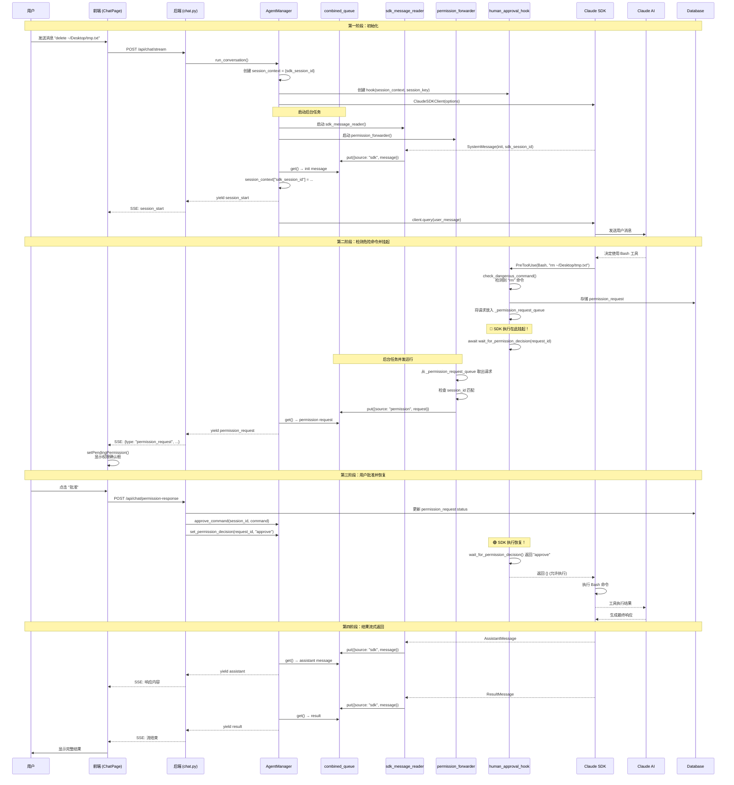
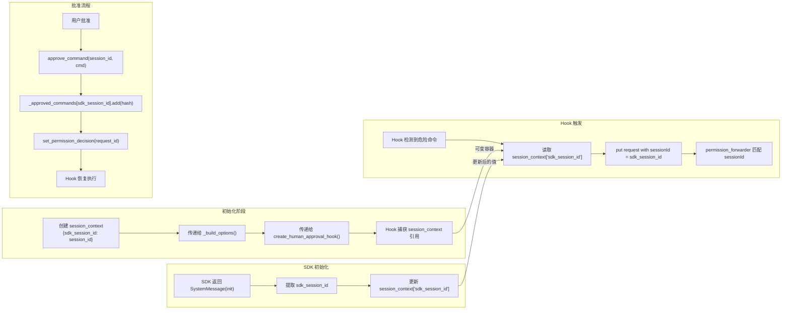
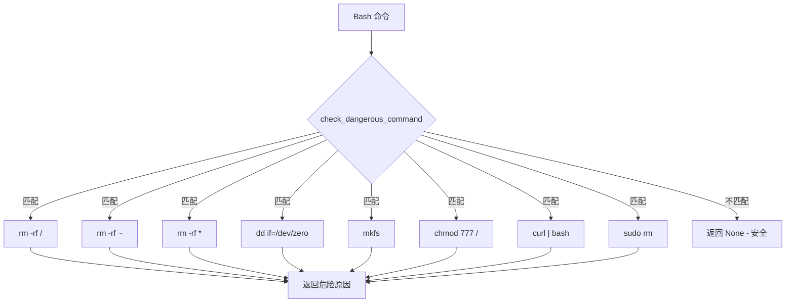
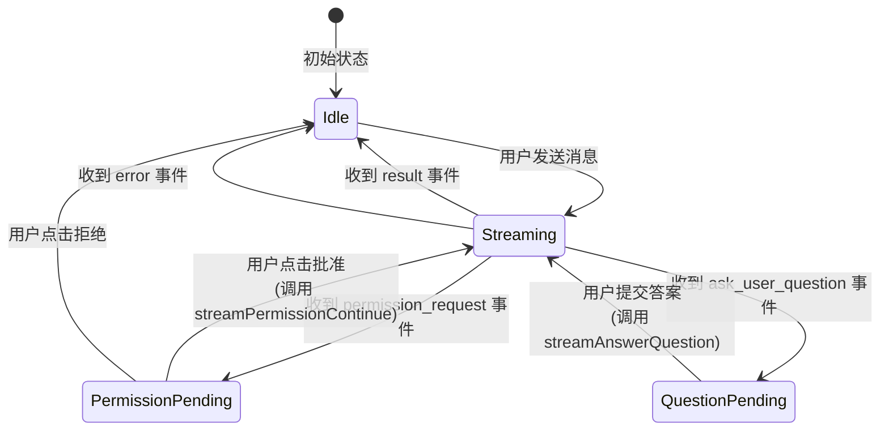

# Human-in-the-Loop (HITL) Permission System Flow

本文档描述了危险命令的人工审批流程。

## 🆕 新架构：Combined Queue 并发模式 (2026-01)

**核心改进：真正的挂起/恢复机制**

- ✅ Hook 使用 `await wait_for_permission_decision()` 真正挂起 SDK 执行
- ✅ 使用 combined queue + 后台任务实现并发事件发射
- ✅ 无需 `/permission-continue` 端点 - 直接通过 `/permission-response` 恢复
- ✅ 同一个 SSE 流中发出权限请求并等待决策
- ✅ 避免了 async generator 死锁问题

## 整体时序图



## 关键数据流 (新架构)

```mermaid
flowchart TB
    subgraph Storage ["模块级存储"]
        GQ[_permission_request_queue<br/>asyncio.Queue - 全局]
        PE[_permission_results<br/>Dict - request_id → Event]
        AC[_approved_commands<br/>Dict - session_id → Set]
    end

    subgraph BgTasks ["后台任务 (并发运行)"]
        SDKReader[sdk_message_reader<br/>读取 SDK 消息]
        PermFwd[permission_forwarder<br/>转发权限请求]
    end

    subgraph MainLoop ["主循环"]
        CQ[combined_queue<br/>合并事件流]
        MainLoop --> |从队列读取| CQ
        CQ --> |SDK 消息| Frontend1[Yield to Frontend]
        CQ --> |权限请求| Frontend2[Yield to Frontend]
    end

    subgraph Hook ["Hook 挂起机制"]
        H1[Hook 检测危险命令]
        H1 --> |put| GQ
        H1 --> |存储| DB[(Database)]
        H1 --> |await| WaitDec[wait_for_permission_decision]
        WaitDec --> |等待| PE
    end

    subgraph Approval ["批准流程"]
        UserDec[用户决策]
        UserDec --> |POST /permission-response| API
        API --> |更新 DB| DB
        API --> |add| AC
        API --> |set| PE
        PE --> |唤醒| WaitDec
    end

    GQ --> |get| PermFwd
    PermFwd --> |session_id 匹配| CQ
    SDKReader --> |所有消息| CQ
```

## Session ID 流转 (新架构)



## 危险命令检测模式



## 前端状态流转



## 核心代码位置 (新架构)

| 功能 | 文件 | 函数/位置 | 说明 |
|------|------|----------|------|
| Hook 创建 | `agent_manager.py:256-341` | `create_human_approval_hook()` | 接收 session_context 参数 |
| 危险命令检测 | `agent_manager.py` | `check_dangerous_command()` | 检测模式匹配 |
| 权限请求队列 | `agent_manager.py:40-41` | `_permission_request_queue` | 全局 asyncio.Queue |
| 权限决策存储 | `agent_manager.py:38` | `_permission_results` | Dict[str, asyncio.Event] |
| 批准命令存储 | `agent_manager.py:36` | `_approved_commands` | Dict[str, Set[str]] |
| 挂起等待决策 | `agent_manager.py` | `wait_for_permission_decision()` | await + timeout |
| 设置决策 | `agent_manager.py` | `set_permission_decision()` | 唤醒 Event |
| Combined Queue | `agent_manager.py:883-1074` | `run_conversation()` | 主消息循环 |
| SDK 消息读取器 | `agent_manager.py:890-909` | `sdk_message_reader()` | 后台任务 |
| 权限请求转发器 | `agent_manager.py:912-925` | `permission_forwarder()` | 后台任务 |
| API 端点 (批准) | `chat.py:294-346` | `/permission-response` | 记录决策并唤醒 Hook |
| API 端点 (已废弃) | `chat.py:349-438` | `/permission-continue` | 旧端点，可移除 |
| 前端权限弹框 | `ChatPage.tsx` | `PermissionRequestModal` | 显示批准/拒绝按钮 |
| 前端处理决策 | `ChatPage.tsx` | `handlePermissionDecision()` | 调用 API |

## 日志关键字 (新架构)

| 日志关键字 | 含义 | 位置 |
|-----------|------|------|
| `[PRE-TOOL]` | Hook 被调用 | hook 函数 |
| `[PERMISSION_REQUEST]` | 检测到危险命令，创建权限请求 | hook 函数 |
| `Waiting for user decision on request` | Hook 挂起，等待用户决策 | hook 函数 |
| `User decision received` | 用户决策到达，Hook 恢复 | hook 函数 |
| `[APPROVED]` | 命令已被批准，允许执行 | hook 函数 |
| `[BLOCKED]` | 命令被阻止（无人工审批模式） | hook 函数 |
| `Forwarding permission request ... to combined queue` | 转发请求到主循环 | permission_forwarder |
| `Emitting permission request` | 发送权限请求到前端 | run_conversation |
| `Captured SDK session_id from init` | 从 SDK 初始化消息捕获 session_id | run_conversation |
| `SDK message reader error` | SDK 子进程错误 | sdk_message_reader |
| `SDK iterator finished` | SDK 消息流结束 | run_conversation |
| `Permission decision for request` | 收到用户决策 | set_permission_decision |
| `Human approval hook added for session_key` | Hook 创建时的 session_key | _build_options |

## 架构优势与解决的问题

### ✅ 解决的核心问题

1. **Async Generator 死锁**：
   - **问题**：`async for message in client.receive_response()` 只在 SDK 发送消息时迭代，当 Hook 挂起 SDK 执行时，循环无法检查 event_queue
   - **解决**：使用 combined queue + 后台任务，将 SDK 消息读取和权限请求转发分离到独立任务

2. **真正的挂起/恢复**：
   - **问题**：旧实现立即返回 deny，需要用户批准后重新发送消息，不是真正的挂起
   - **解决**：Hook 使用 `await wait_for_permission_decision()`，SDK 执行真正暂停，批准后直接恢复

3. **Session ID 一致性**：
   - **问题**：新会话时 Hook 使用 `agent_id`，但批准后使用 `sdk_session_id`，导致批准记录查找失败
   - **解决**：使用 `session_context` 可变字典，Hook 在触发时读取实际的 `sdk_session_id`

4. **并发安全**：
   - **问题**：多个代理同时运行时，权限请求可能路由错误
   - **解决**：`permission_forwarder` 使用 session_id 过滤，确保请求只发送给正确的代理

### ⚠️ 已知限制

1. **Permission Mode 要求**：
   - 必须设置 `permission_mode = "default"`，不能使用 `"bypassPermissions"`
   - `enable_human_approval = true` 必须启用

2. **文件访问控制冲突**：
   - 如果启用了文件访问控制，即使命令被批准，路径不在允许目录内仍会被阻止
   - 检查日志中的 `allowed directories` 确认是否包含目标路径

3. **SDK 子进程稳定性**：
   - 依赖 Claude Code CLI 子进程，如果子进程崩溃会导致整个流程失败
   - 需要确保 `claude-code` CLI 正确安装并可访问

## 调试检查清单

遇到问题时按以下顺序检查：

1. ✅ **Agent 配置**：`permission_mode = "default"` 且 `enable_human_approval = true`
2. ✅ **SDK 子进程**：检查日志中是否有 `SDK message reader error`
3. ✅ **Session ID**：确认日志中 `Captured SDK session_id` 和 `Forwarding permission request` 使用相同 session_id
4. ✅ **Queue 流转**：检查是否看到 `Emitting permission request` 日志
5. ✅ **Frontend 接收**：检查浏览器 DevTools Network 标签页，SSE 流中是否有 `permission_request` 事件

---

## 技术突破：解决 Async Generator 死锁

### 问题根源

在 Python 中，async generator 只能在主协程中 yield 值，无法从后台任务中 yield。这导致了一个根本性的问题：

```python
# ❌ 这不起作用！
async def broken_approach():
    event_queue = asyncio.Queue()

    async def background_task():
        request = await get_permission_request()
        # 无法从这里 yield！只能放入队列
        await event_queue.put(request)

    asyncio.create_task(background_task())

    # 主循环只在 SDK 发送消息时迭代
    async for message in client.receive_response():
        # 当 SDK 被 hook 挂起时，这个循环不会执行
        # 所以永远不会检查 event_queue
        # → 死锁！
        while not event_queue.empty():
            yield event_queue.get_nowait()
        yield message
```

### 解决方案：Combined Queue Pattern

将所有事件源合并到单一队列，主循环直接从队列读取：

```python
# ✅ 这才是正确的！
async def working_approach():
    combined_queue = asyncio.Queue()

    # 后台任务1：读取 SDK 消息
    async def sdk_reader():
        async for message in client.receive_response():
            await combined_queue.put({"source": "sdk", "message": message})

    # 后台任务2：转发权限请求
    async def permission_forwarder():
        while True:
            request = await global_queue.get()
            await combined_queue.put({"source": "permission", "request": request})

    asyncio.create_task(sdk_reader())
    asyncio.create_task(permission_forwarder())

    # 主循环：从合并队列读取
    # 即使 SDK 被挂起，permission_forwarder 仍然可以放入事件
    while True:
        item = await combined_queue.get()
        if item["source"] == "permission":
            yield {"type": "permission_request", ...}
        elif item["source"] == "sdk":
            yield process_sdk_message(item["message"])
```

### 关键洞察

1. **并发不是并行**：两个后台任务在事件循环中交替执行，即使 SDK iterator 被阻塞，permission forwarder 仍可运行
2. **队列作为桥梁**：combined_queue 是唯一的数据源，主循环只需要 `await queue.get()`
3. **可变容器共享状态**：`session_context` 字典允许 hook 在触发时读取最新的 `sdk_session_id`

### 实现细节

```python
# agent_manager.py:883-1074
async def run_conversation(self, agent_id, user_message, session_id, ...):
    # 1. 创建可变容器共享 session_id
    session_context = {"sdk_session_id": session_id}

    # 2. 构建 options，传递 session_context 给 hook
    options = await self._build_options(agent_config, ..., session_context)

    # 3. 创建 combined queue
    combined_queue = asyncio.Queue()

    # 4. 启动两个后台任务
    asyncio.create_task(sdk_message_reader())      # 读取 SDK 消息
    asyncio.create_task(permission_forwarder())     # 转发权限请求

    # 5. 主循环从 combined queue 读取
    while True:
        item = await combined_queue.get()
        # 根据 source 类型处理不同事件
```

### 为什么这样有效

- **Hook 挂起 SDK**：`await wait_for_permission_decision()` 阻塞 SDK 执行
- **SDK Reader 也被阻塞**：`async for message in client.receive_response()` 暂停
- **但 Permission Forwarder 继续运行**：它从全局队列读取，不依赖 SDK
- **Permission Request 进入 Combined Queue**：主循环立即获取并 yield
- **Frontend 接收权限请求**：用户可以批准/拒绝
- **决策唤醒 Hook**：`set_permission_decision()` 触发 Event
- **SDK 恢复执行**：Hook 返回，SDK 继续，新消息进入 combined queue
- **流继续**：主循环继续从队列读取并 yield

这种模式完美解决了 async generator 的并发限制，同时保持了代码的简洁性和可维护性。

---

*本文档最后更新：2026-01-18*
*实现版本：Combined Queue Architecture v1.0*
